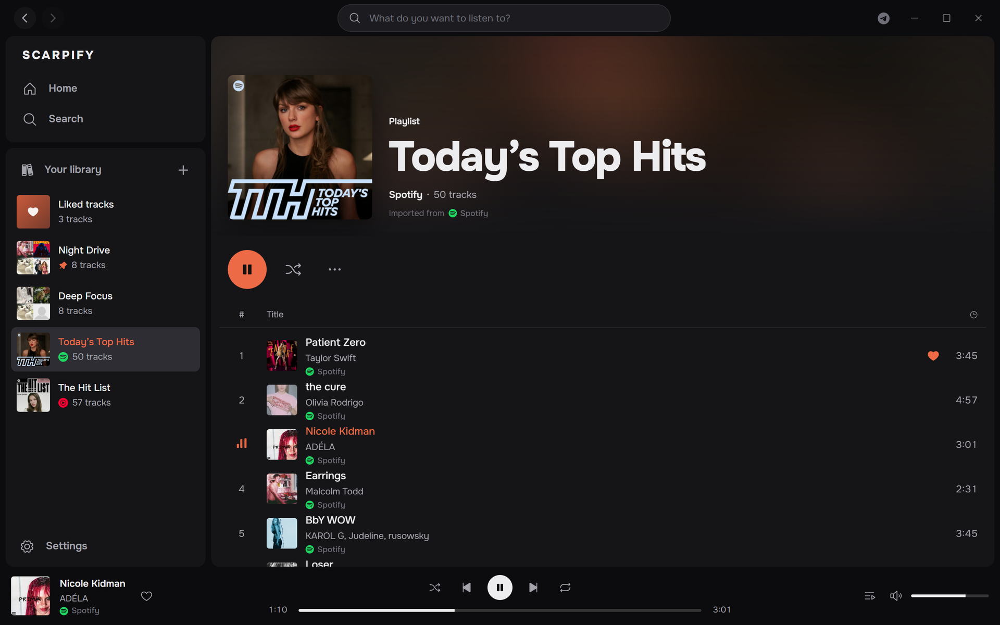
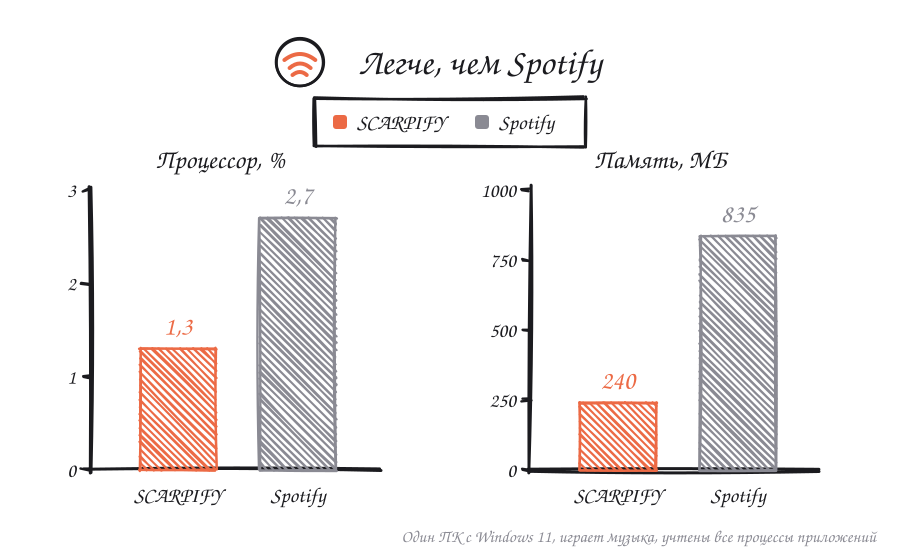
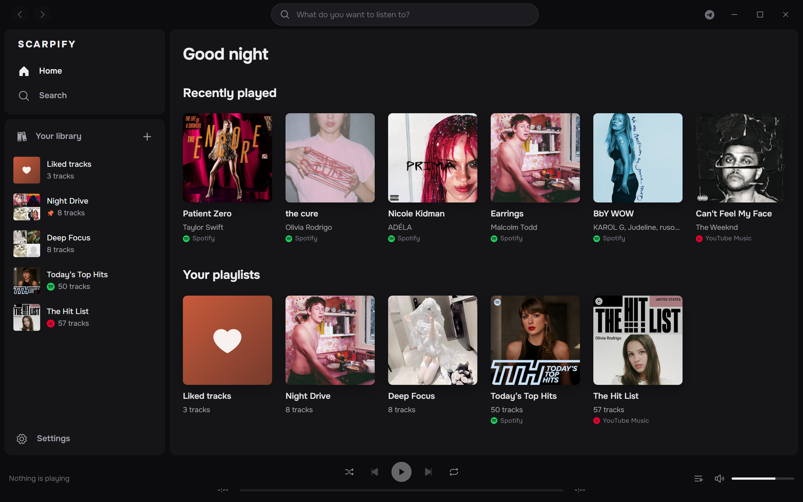
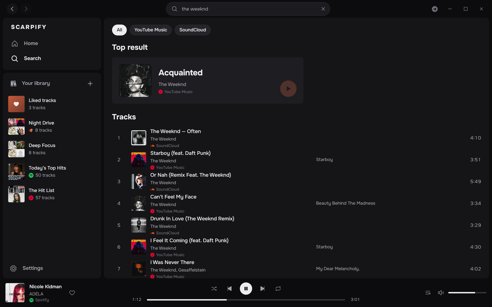
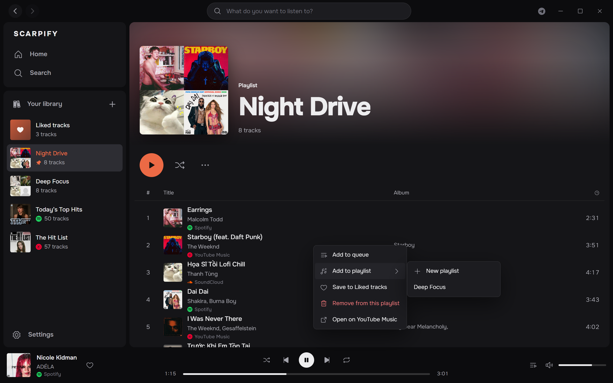
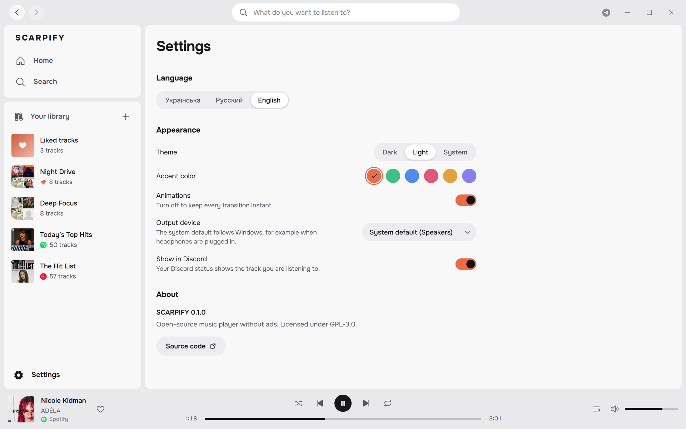

<p align="center">
  
</p>

<h1 align="center">SCARPIFY</h1>

<p align="center">
  Музыкальный плеер с открытым исходным кодом для YouTube Music и SoundCloud.<br>
  Без рекламы, без аккаунтов, одна медиатека.
</p>

<p align="center">
  <a href="https://github.com/scarrymany/scarpify/releases/latest"></a>
  <a href="https://github.com/scarrymany/scarpify/releases"></a>
  <a href="https://github.com/scarrymany/scarpify/actions/workflows/ci.yml"></a>
  
  <a href="LICENSE"></a>
</p>

<p align="center">
  <a href="https://github.com/scarrymany/scarpify/releases/latest"><b>Скачать для Windows</b></a> ·
  <a href="README.md">English</a>
</p>

<p align="center">
  
</p>

## Зачем SCARPIFY

Музыка разбросана по сервисам, и каждый хочет аккаунт, подписку или ваше внимание к рекламе. SCARPIFY собирает YouTube Music и SoundCloud в одном спокойном интерфейсе, переносит плейлисты из Spotify по ссылке и хранит медиатеку у вас на компьютере.

## Легче, чем Spotify

<p align="center">
  
</p>

Замер на одном и том же ПК с Windows 11 во время воспроизведения, суммированы все процессы каждого приложения (у SCARPIFY это включая процессы интерфейса WebView2). Само ядро на Rust занимает около 11 МБ.

## Возможности

**Прослушивание**
- Поиск сразу по YouTube Music и SoundCloud. У каждого трека указан сервис, откуда он взят.
- Нативное воспроизведение на Rust: трек начинает играть, пока ещё скачивается, громкость выравнивается по данным YouTube.
- Очередь с перетаскиванием, перемешивание и повтор, горячие клавиши.
- Выбор устройства вывода или «системное по умолчанию», которое переключается вслед за Windows при подключении наушников. Трек при этом продолжается с того же места.

**Медиатека**
- Свои плейлисты: создание, переименование прямо в заголовке, добавление треков через правый клик, перетаскивание, своя обложка.
- Импорт публичных плейлистов и альбомов из Spotify, SoundCloud и YouTube Music по ссылке. Треки Spotify подбираются и играют через YouTube Music, аккаунт Spotify не нужен.
- Любимые треки, недавно прослушанное, закреплённые плейлисты. Всё хранится локально в SQLite.

**Интерфейс**
- Тёмная, светлая и системная тема, шесть акцентных цветов, анимации можно выключить.
- Русский, украинский и английский.
- Статус «Слушает SCARPIFY» в Discord с обложкой и прогрессом.

<table>
  <tr>
    <td></td>
    <td></td>
  </tr>
  <tr>
    <td></td>
    <td></td>
  </tr>
</table>

## Установка

Скачайте `SCARPIFY_x.y.z_x64-setup.exe` со [страницы последнего релиза](https://github.com/scarrymany/scarpify/releases/latest) и запустите. Права администратора не нужны, язык установки можно выбрать: русский, украинский или английский.

Поддерживаются Windows 10 и 11 (x64). Если WebView2 не установлен, установщик поставит его сам.

Установщик пока не подписан сертификатом, поэтому Windows SmartScreen может попросить подтверждение: нажмите **Подробнее**, затем **Выполнить в любом случае**.

## Горячие клавиши

| Действие | Клавиши |
| --- | --- |
| Пауза / продолжить | `Пробел` |
| Следующий / предыдущий трек | `Ctrl + →` / `Ctrl + ←` |
| Поиск | `Ctrl + L`, `Ctrl + F` или `/` |
| Назад / вперёд | `Alt + ←` / `Alt + →`, боковые кнопки мыши |

## Сборка из исходников

Нужны [Rust](https://rustup.rs) (stable), [Node.js](https://nodejs.org) 20+ и [зависимости Tauri](https://tauri.app/start/prerequisites/) для вашей системы.

```bash
npm install
npm run tauri dev      # сборка для разработки с горячей перезагрузкой
npm run tauri build    # установщик в src-tauri/target/release/bundle
```

Тесты описаны в [английском README](README.md#building-from-source).

## Связь

Вопросы и идеи: [issues](https://github.com/scarrymany/scarpify/issues) или автору в [Telegram](https://t.me/yeet17).

## Отказ от ответственности

SCARPIFY не связан с YouTube, Google, SoundCloud, Spotify или Discord. Плеер обращается к общедоступным интерфейсам так же, как их веб-клиенты. Используйте его в соответствии с условиями сервисов и законами вашей страны.

## Лицензия

[GPL-3.0-or-later](LICENSE).
